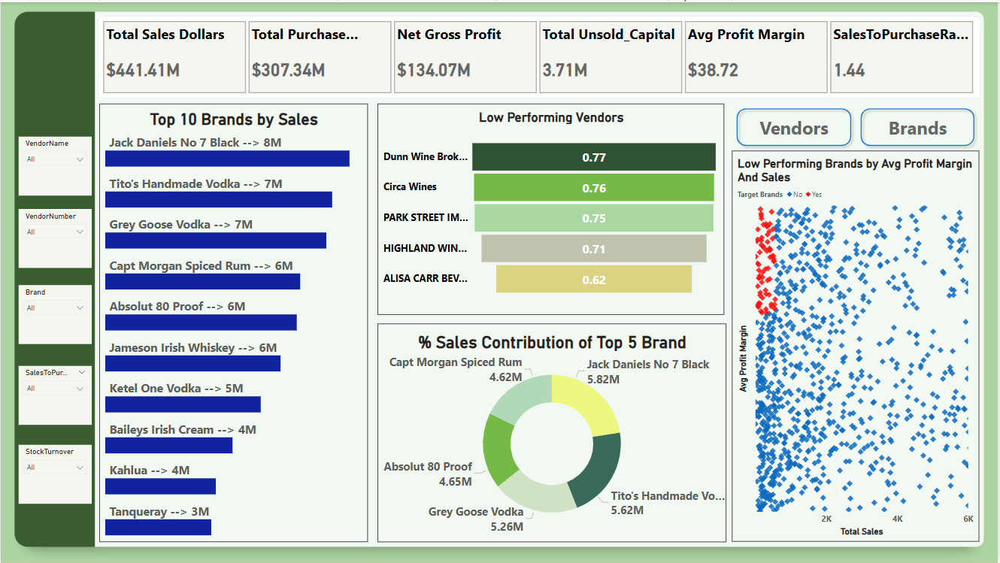

# 🥃 Liquor Vendor Analysis: **Inventory & Sales Optimization**

# **📌 Problem Statement:**
Effective inventory and sales management are critical for optimizing profitability in the liquor retail and wholesale industry. Companies often face challenges such as:
* Inefficient pricing strategies
* Poor inventory turnover
* Vendor dependency and underperformance

This project aims to address these challenges through data analysis and visualization.


# **🎯 Objectives**
The core goals of this vendor analysis are to:
* ✅ **Identify underperforming liquor brands** that may need promotional strategies or pricing adjustments.
* ✅ **Highlight top liquor vendors** contributing to sales and gross profit.
* ✅ **Analyze the impact of bulk purchasing** on unit cost reduction.
* ✅ **Evaluate inventory turnover** to minimize holding costs and improve efficiency.
* ✅ **Compare profitability variance** between high-performing and low-performing vendors.


# **🧰 Tools & Technologies**
* **Python** (for data processing and analysis)
* **SQLite3** (for structured data storage and SQL queries)
* **SciPy/Statsmodels** (for statistical testing)
* **Pandas** (for data manipulation)
* **Matplotlib/Seaborn** (for exploratory data visualization)
* **Power BI** (for interactive dashboard creation)


# **🗂️ Project Workflow**

## **1. Data Integration:**
- Connected multiple .csv files using SQLite3 in Python.
- Performed SQL joins to merge and organize data efficiently.
- Exported the final dataset to a cleaned vendor_summary_sales dataset for further analysis.

## **2. Data Cleaning:**
- Removed duplicates and nulls.
- Standardized column names and formats.
- Converted relevant columns to appropriate data types for analysis.

## **3.Exploratory Data Analysis (EDA):**
* Formulated some research questions such as:
    - Which vendors and brands demonstrate the highest sales performance ?
    - Which vendors contribute the most to total Purchase dollars ?
    - How much of total procurement is dependent on the top vendors ?
    - Does purchasing in bulk reduce the unit price, and what is the optimal purchase volume for cost savings ?
    - Which vendors have low inventory turnover, indicating excess stock and slow-moving products ?
    - How much Capital is locked in unsold inventory per vendor,and which vendors contribute the most to it ?
    - What is the 95% confidence interval for Profit Margins of Top-Performing and Low-Performing Vendors ? 
    - Is there a significant difference in profit margins between top-performing and low-performing vendors?
* Generated visualizations to identify patterns and outliers.

## **4. AB Testing & Statistical Analysis:**
- Performed a two-sample t-test on Profit Margin of low and high performing vendors.
- Calculated confidence intervals to assess the significance of observed changes.
- Performed descriptive statistics to understand groups behavior.


# **📈 AB Testing Results**
## **📊 Test: Difference in Profit Margins Between Vendor Tiers**
### **Research Question:**
- Is there a significant difference in profit margins between top-performing and low-performing vendors?
### **Hypotheses:**
- **H₀ (Null Hypothesis)**: There is no significant difference in the mean profit margins of top-performing and low-performing vendors.
- **H₁ (Alternative Hypothesis)**: The mean profit margins of top-performing and low-performing vendors are significantly different.

### **Test**: 
- Two-sample t-test
### **Significance Level (α):**
- 0.05
### **p-value:**
- 0.0037
### **✅ Result:** Since the p-value < 0.05, we **reject H₀**.
### **Conclusion:** There is a **statistically significant difference** in profit margins between top-performing and low-performing vendors.


# **📊 Power BI Dashboard**
- Built an interactive dashboard using the cleaned **vendor_summary_sales** dataset.

## Dashboard Overview:
  
*Figure 1: Interactive Power BI dashboard showing vendor sales and performance metrics.*

##  Key KPIs:
- Total Sales: $441.41M
- Total Purchase: $307.34M
- Gross Profit: $134.07M
- Gross Profit Margin: 38.7%
- Unsold Capital: $2.71M
- SalesToPurchaseRatio: 1.44

## Vendor Contribution:
- Top 10 vendors contribute **65.7%** of total sales
* Top contributors:
    - Diageo North America – **16.3%**
    - Martignetti Companies –**8.3%**
    - Pernod Ricard USA – **7.8%**

###  Top Vendors by Sales:
- Diageo – $68M
- Martignetti – $39M
- Pernod Ricard – $32M

### Low-Performing Vendors:
- Alisa Carr Beverages – 0.615
- Highland Wines – 0.708
- Park Street Imports – 0.751

## Brand-Level Performance:
### Top Brands by Sales:
- Jack Daniel’s – $8.0M
- Tito’s Handmade Vodka – $7.4M
- Grey Goose Vodka – $7.2M

### Low-Performing Brands:
Brands with low average profit margins are prevalent across all sales ranges, suggesting a need for pricing review or cost control.

## Capital Efficiency:
- **Unsold Capital** of $2.71M indicates overstock or inefficiency in stock turnover.

# **✅ Final Insights & Recommendations**
## **📌 Key Insights:**
- Top 10 vendors drive a disproportionate share of profitability—**65.7%** of sales.The remaining vendors contribute only **34.31%**, meaning they are not utilized effectively or may not be as competitive.
If vendor dependency is too high, consider identifying new suppliers to reduce risk.
- Vendors buying in bulk (Large Order Size) get the lowest unit price (**$10.78** per unit), meaning higher margins if they can manage inventory efficiently.
- The price difference between Small and Large orders is substantial (**~72%** reduction in unit cost)
- This suggests that bulk pricing strategies successfully encourage vendors to purchase in larger volumes, leading to higher overall sales despite lower per-unit revenue.
- Slow-moving inventory increases holding costs (warehouse rent, insurance, depreciation).
- Identifying vendors with low inventory turnover is critical for business efficiency, cost reduction, and profitability.

## **Insights Regarding AB-Testing:**
- The confidence interval for low-performing vendors (**40.48%** to **42.62%**) is significantly higher than that of top-performing vendors (**30.74%** to **31.61%**).
- This suggests that vendors with lower sales tend to maintain higher profit margins, potentially due to premium pricing or lower operational costs.
- For High-Performing Vendors: If they aim to improve profitability, they could explore selective price adjustments, cost optimization, or bundling strategies.
- For Low-Performing Vendors: Despite higher margins, their low sales volume might indicate a need for better marketing, competitive pricing, or improved distribution strategies.
- P-value=0.0000 of this small suggests that the difference is not just statistically significant but also practically meaningful.
- The two vendor groups operate very differently in terms of profitability.

## **✅ Strategic Recommendations**
- **Re-evaluate pricing** for **low-sales**, **high-margin brands** to **boost sales volume** without sacrificing **profitability**. 
- Diversify **vendor partnerships** to reduce dependency on a few **suppliers** and mitigate **supply chain risks**. 
- Leverage **bulk purchasing** advantages to maintain **competitive pricing** while optimizing inventory management. 
- **Optimize slow-moving** inventory by adjusting **purchase quantities**, **launching clearance sales**, or **revising storage strategies**. 
- **Enhance marketing and distribution strategies** for low-performing vendors to drive higher **sales volumes** without compromising profit margins. 
- By implementing these recommendations, the company can achieve **sustainable profitability**,**mitigate risks**, and enhance overall **operational efficiency**. 

* In the end please refer to the **Vendor_analysis_report.docx** file for detailed Analysis within report_file section.

# 📂 Repository Structure

```bash
vendor-analysis/
├── 📂 data/
│   ├── 📂 raw/                  # Original CSV files (unprocessed)
│   └── 📂 cleaned/             # Processed datasets (analysis-ready)
│
├── 📂 notebooks/
│   ├── 📘 exploratory_data_analysis.ipynb  # Data cleaning & exploration
│   └── 📘 vendor_analysis.ipynb            # Main analysis & insights
│
├── 📂 dashboard/
│   ├── 📊 vendor_dashboard.pbix            # Interactive Power BI dashboard
│   └── 📄 vendor_summary_sales.csv         # Processed data for dashboard
│
├── 📂 database/
│   └── 🐍 ingestion_db.py      # Database connection & ETL logic
│
├── 📂 logs/
│   └── 📜 ingestion_db.log     # Execution logs (debugging)
│
├── 📂 reports/
│   └── 📑 Vendor_analysis_report.docx      # Final analysis report
│
└── 📄 README.md                # Project overview & setup guide
```
# **🚀 Getting Started**
## 1.Clone the repository:
https://github.com/Harddik1611/Vendor-Analysis-Project.git
cd vendor-analysis
## 2.Run the analysis notebook:
jupyter notebook notebooks/vendor_analysis.ipynb
## 3.Open the Power BI dashboard from /vendor_analysis_dashboard.pbix

# **📬 Contact**
- For questions or collaboration, reach out via GitHub Issues or harddik05@gmail.com.
